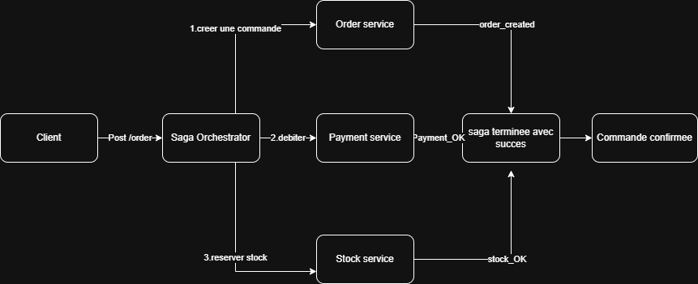
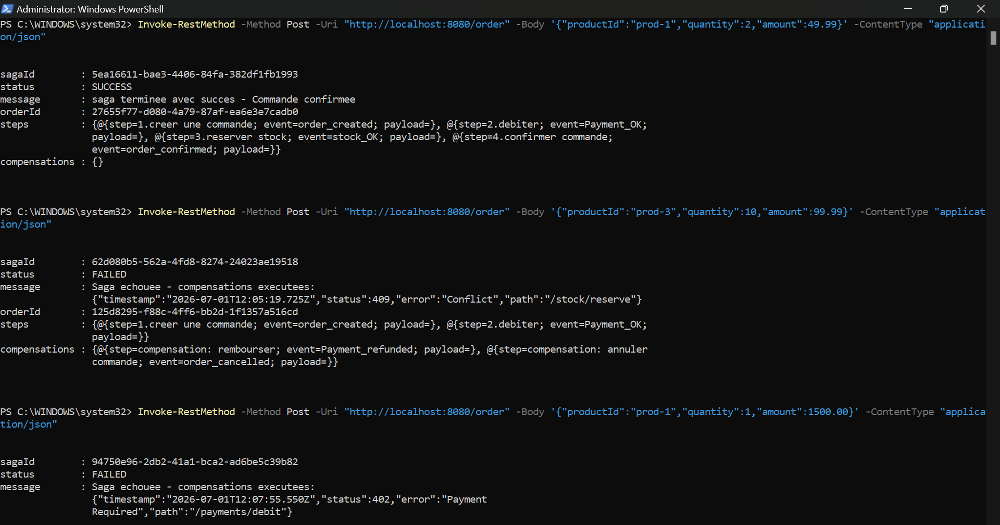

# E-commerce — Saga Pattern (Orchestration)

Application e-commerce distribuée basée sur le **pattern Saga en orchestration**. Un orchestrateur central coordonne trois microservices (Order, Payment, Stock) pour placer une commande de manière cohérente, avec des **transactions de compensation** en cas d'échec.

## Architecture
# E-commerce — Saga Pattern (Orchestration)

Application e-commerce distribuée basée sur le **pattern Saga en orchestration**. Un orchestrateur central coordonne trois microservices (Order, Payment, Stock) pour placer une commande de manière cohérente, avec des **transactions de compensation** en cas d'échec.



En cas d'échec, l'orchestrateur exécute les compensations dans l'ordre inverse :

| Étape en échec | Compensations |
|----------------|---------------|
| Paiement       | Annuler la commande |
| Stock          | Rembourser le paiement + annuler la commande |

## Prérequis

- **Java 21**
- **Maven** (ou utiliser le wrapper `mvnw` inclus dans chaque service)

Vérifier l'installation :

```powershell
java -version
```

## Démarrage des services

Chaque microservice doit tourner dans un **terminal séparé**. Lancer d'abord les services métier, puis l'orchestrateur.

### Terminal 1 — Order Service (port 8081)

```powershell
cd order-service
.\mvnw.cmd spring-boot:run
```

### Terminal 2 — Payment Service (port 8082)

```powershell
cd payment-service
.\mvnw.cmd spring-boot:run
```

### Terminal 3 — Stock Service (port 8083)

```powershell
cd stock-service
.\mvnw.cmd spring-boot:run
```

### Terminal 4 — Saga Orchestrator (port 8080)

```powershell
cd saga-orchestrator
.\mvnw.cmd spring-boot:run
```

Attendre le message `Started ...Application` dans chaque terminal avant de tester.

## Tester l'application

Point d'entrée unique : **POST** `http://localhost:8080/order`

Corps JSON :

```json
{
  "productId": "prod-1",
  "quantity": 2,
  "amount": 49.99
}
```

### Commande réussie

```powershell
Invoke-RestMethod -Method Post -Uri "http://localhost:8080/order" -ContentType "application/json" -Body '{"productId":"prod-1","quantity":2,"amount":49.99}'
```

Réponse attendue : `"status": "SUCCESS"` avec les 4 étapes de la saga.

### Échec — stock insuffisant

Le produit `prod-3` n'a que **5 unités** en stock.

```powershell
Invoke-RestMethod -Method Post -Uri "http://localhost:8080/order" -ContentType "application/json" -Body '{"productId":"prod-3","quantity":10,"amount":99.99}'
```

Réponse attendue : `"status": "FAILED"` avec les compensations (remboursement + annulation).

### Échec — paiement refusé

Les montants supérieurs à **1000 €** sont refusés.

```powershell
Invoke-RestMethod -Method Post -Uri "http://localhost:8080/order" -ContentType "application/json" -Body '{"productId":"prod-1","quantity":1,"amount":1500.00}'
```

Réponse attendue : `"status": "FAILED"` avec compensation (annulation de la commande).




## Stock initial

| Produit  | Stock disponible |
|----------|------------------|
| `prod-1` | 100              |
| `prod-2` | 50               |
| `prod-3` | 5                |

## Compilation (sans lancer)

Depuis la racine du projet, compiler chaque service :

```powershell
cd order-service; .\mvnw.cmd package -DskipTests
cd ..\payment-service; .\mvnw.cmd package -DskipTests
cd ..\stock-service; .\mvnw.cmd package -DskipTests
cd ..\saga-orchestrator; .\mvnw.cmd package -DskipTests
```

## Structure du projet

```
e-commerce/
├── saga-orchestrator/   # Orchestrateur Saga (API POST /order)
├── order-service/       # Gestion des commandes
├── payment-service/     # Débit et remboursement
└── stock-service/       # Réservation et libération de stock
```

## Ports utilisés

| Service           | Port |
|-------------------|------|
| saga-orchestrator | 8080 |
| order-service     | 8081 |
| payment-service   | 8082 |
| stock-service     | 8083 |

## API des microservices (appelées par l'orchestrateur)

| Service | Endpoint | Action |
|---------|----------|--------|
| Order   | `POST /orders` | Créer une commande |
| Order   | `POST /orders/{id}/confirm` | Confirmer |
| Order   | `POST /orders/{id}/cancel` | Annuler (compensation) |
| Payment | `POST /payments/debit` | Débiter |
| Payment | `POST /payments/{orderId}/refund` | Rembourser (compensation) |
| Stock   | `POST /stock/reserve` | Réserver |
| Stock   | `POST /stock/{orderId}/release` | Libérer (compensation) |
